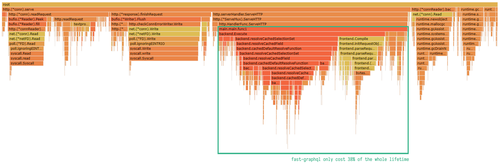

fast-graphql
------------

([English](./README.md) | [中文](./README-zh-CN.md))

# 说明

该项目是一个 Go 语言编写的实验性 GraphQL 实现. 目的是将 GraphQL 的性能提升到一个新的水平.  
目前, 该项目在尝试使用 GraphQL JIT, 缓存优化, ASM 优化 Parser, SIMD 优化等方法来提升性能.  

注意: 本项目仍然在构建中, 并不可以投入生产使用.

# 性能

在典型的 0.2 KB 大小 GraphQL 请求测试中 ([1](./DOCUMENTS/benchmark-example-request-with-builtin-variables.graphql), [2](./DOCUMENTS/benchmark-example-request-with-query-variables.graphql)), fast-graphql 与其他 GraphQL 实现的性能对比如下:

当使用 net/http 库时, fast-graphql 只占用 **38%** 的运行周期时间, 其余开销为 het/http, I/O, runtime GC 等开销. 这意味着, 当使用其他 http 库 (例如 fasthttp)时, 可以获得更佳的性能.

# 里程碑

作为一个实验性项目, 我们会尽可能尝试我们所了解的或业界前沿的技术以提升性能. 下面罗列了一些计划中的想法或进度:

- 准备和外围工作. (✔️)
  - [GraphQL 的 EBNF 定义](https://github.com/karminski/graphql-grammar-ebnf-definition), 方便构建编译器前端. (✔️)
- GraphQL 特性实现. ()
  - GraphQL Lexer & Parser. (✔️)
  - 一个只有 Query Operation 的最小 Demo. (✔️)
  - GraphQL 周边特性
- 前端优化
  - [参数代换](./DOCUMENTS/Arguments-Substitution-CN.md). (✔️)
- 后端优化
  - 字符串序列化优化. (✔️)
- 反射优化
  - [优化 Struct 和 Slice 的反射性能](https://github.com/karminski/fastreflect). (✔️)
- 序列化/反序列化优化 (✔️)
  - [实现 Request Parser, 替换 JSON 解析器](./DOCUMENTS/Request-Parser-CN.md). (✔️)
  - 取消JSON生成器, 采用后端解析过程实时生成结果. (✔️)
- [缓存优化](./DOCUMENTS/Cache-Policy-CN.md) 
  - AST缓存. (✔️)
  - 后端缓存. (✔️)
- GraphQL JIT
  - ASM 优化 Parser 的 Demo. (✔️)
  - JIT 前端原型. ()
  - JIT 后端原型. (✔️)
  - function call 导致的 GC 扫描被判为非法问题. ()
  - ASM & SIMD 优化. ()
- GC & memory 优化. ()
- 用户使用 Demo. ()
- 测试. ()

# 演示和例子

- [Benchmark](./src/cmd/flamegraph/main.go)
- [HTTP Query Demo](./src/cmd/http-query-example/main.go)
- [HTTP Mutation Demo](./src/cmd/http-mutation-example/main.go)

# 文档

- [现存问题](./DOCUMENTS/Issues/)
- [事项列表](./DOCUMENTS/TODO-List.md)
- [想法和优化方案](./DOCUMENTS/Ideas.md)

# 依赖

本项目的初期版本的后端逻辑是从 [graphql-go](https://github.com/graphql-go/graphql) 移植而来, Parser & Lexer 部分则受到了 Lua 的启发构建而成.

# 作者

- [karminski](https://github.com/karminski)

# 协议

- [MIT](./LICENSE)

# 引用

- [GraphQL Grammar EBNF Definition](https://github.com/karminski/graphql-grammar-ebnf-definition)
- [GraphQL Specification](http://spec.graphql.org/)
- [GraphQL Specification on Github](https://github.com/graphql/graphql-spec)