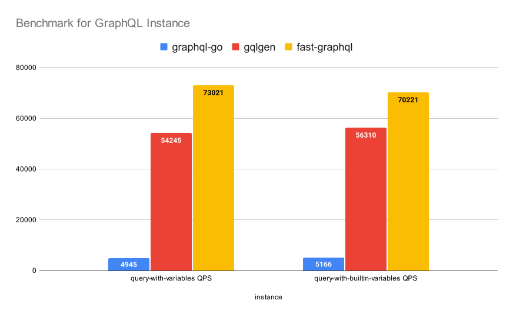

fast-graphql
------------

([English](./README.md) | [中文](./README-zh-CN.md))

# Description

fast-graphql is an experimental GraphQL implementation with Golang. This repo focuses on improve GraphQL speed to a new level.    

For now, we will try GraphQL JIT, Cache Optimize runtime, Raw-ASM Parser, and SIMD methods to optimize.    

WARNING: this repo is under construction, not production-ready.  

# 性能

In a typical 0.2 KB GraphQL request test ([1](./DOCUMENTS/benchmark-example-request-with-builtin-variables.graphql), [2](./DOCUMENTS/benchmark-example-request-with-query-variables.graphql)), the performance comparison between fast-graphql and other GraphQL implementations is as follows:  

When using the net/http library, fast-graphql takes up only **38%** of the runtime time, with the rest of the overhead being net/http, I/O, Runtime GC, and so on.  

This means that better performance can be achieved when using other HTTP libraries, such as fasthttp.    

# Steps & Objects

- Prepare.
  - [EBNF Documents for Graphql](https://github.com/karminski/graphql-grammar-ebnf-definition). (✔️)
- GraphQL Features.
  - GraphQL Lexer & Parser. (✔️)
  - A Minimal Demo with Query Operation. (✔️)
  - GraphQL Features
- Frontend Optimize
  - [Arguments-Substitution](./DOCUMENTS/Arguments-Substitution-CN.md). (✔️)
- Backend Optimize
  - Strings Serialization Optimize. (✔️)
- Reflect Optimize
  - [Optimize for Golang Struct and Slice reflect performance](https://github.com/karminski/fastreflect). (✔️)
- Serialization/Deserialization Optimize (✔️)
  - [Request-Parser](./DOCUMENTS/Request-Parser-CN.md). (✔️)
  - Replace encoding/json with result buffer. (✔️)
- [Cache-Policy](./DOCUMENTS/Cache-Policy-CN.md) 
  - AST Cache. (✔️)
  - Backend Cache. (✔️)
- GraphQL JIT
  - ASM Parser Demo. (✔️)
  - JIT Frontend Prototype. ()
  - JIT Backend Prototype. (✔️)
  - function call cause GC kill the progress issue. ()
  - ASM & SIMD Optimize. ()
- GC & memory Optimize. ()
- Demo for Usage. ()
- Test & Testcase. ()

# Examples

- [Benchmark](./src/cmd/flamegraph/main.go)
- [HTTP Query Demo](./src/cmd/http-query-example/main.go)
- [HTTP Mutation Demo](./src/cmd/http-mutation-example/main.go)

# Documents

- [现存问题](./DOCUMENTS/Issues/)
- [事项列表](./DOCUMENTS/TODO-List.md)
- [想法和优化方案](./DOCUMENTS/Ideas.md)

# Dependency

The basic backend logic of this repo is port from [graphql-go](https://github.com/graphql-go/graphql), and the lexer & parser are inspired by Lua.

# Contributors

- [karminski](https://github.com/karminski)

# License

- [MIT](./LICENSE)

# Reference

- [GraphQL Grammar EBNF Definition](https://github.com/karminski/graphql-grammar-ebnf-definition)
- [fastreflect](https://github.com/karminski/fastreflect)
- [GraphQL Specification](http://spec.graphql.org/)
- [GraphQL Specification on Github](https://github.com/graphql/graphql-spec)